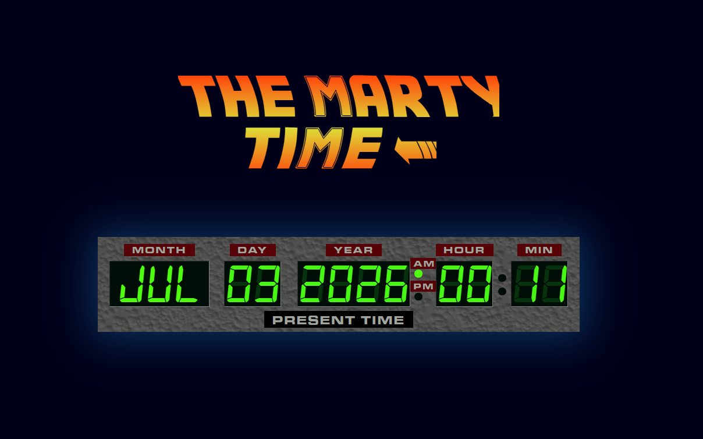
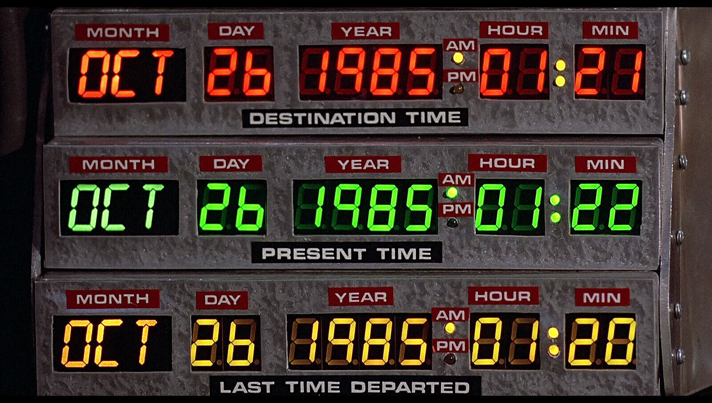

# 🕰️ The Marty Time

Ce projet reproduit un des cadrans de l'horloge de la DeLorean de Doc dans Retour Vers le Futur, il donne l'heure et la date du jour.

### Aperçus:

**Inspiration:**  

## Stack:

- HTML
- CCS
- JavaScript

## Installation:

Aucune installation nécessaire.

## Fonctionnalités:

- Affichage de l'heure.
- Affichage de la date.
- Animation cligonttements, switch AM/PM.

## Statut projet:

Side project terminé.

**Lidobix**
